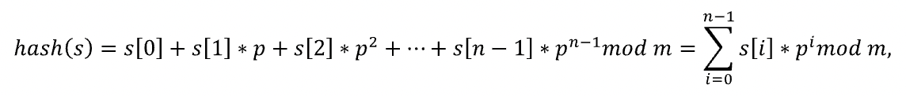

# Решение демоварианта

### Задача 1.
Все ребята сдали свои проекты и получили оценки на защите, но Хадаров Владимир все прослушал
и просит помочь ему узнать какую оценку за проект он получил. Пожалуйста, подскажите
Владимиру какую оценку он получил.

Формат вывода: 
```
Ты получил: <ОЦЕНКА>, за проект - <ID_ПРОЕКТА>
```

Пока помогали Владимиру увидели, что многие ученики потеряли свои оценки при выкачке с
сайта. Из-за этого нет возможности посмотреть общую статистику. Чтобы избежать путаницы
поставьте вместо ошибки среднее значение по классу и округлите до трех знаков после запятой.


Сохраните данные в новую таблицу с названием student_new.csv.

***В задаче запрещено использование сторонних библиотек(Pandas и др)
Не забудьте сделать комментарии к коду согласно стандартам документирования кода
выбранного языка (для языка Python – PEP 257). После выполнения необходимо сделать локальные
и удаленные изменения Вашего репозитория.***

### Задача 2

Данные из таблицы student.csv необходимо отсортировать по столбцу оценки(score) с помощь
сортировки вставками (В задаче нельзя использовать встроенные функции сортировок!). Из
полученного списка выделите первых 3х победителей из 10 класса. Данные о победителях
необходимо вывести в формате:

```
<X> класс:

1 место: <И. Фамилия>

2 место: <И. Фамилия>

3 место: <И. Фамилия>

…
```

***Не забудьте сделать комментарии к коду согласно стандартам документирования кода
выбранного языка. После выполнения необходимо сделать локальные и удаленные изменения
Вашего репозитория***

### Задача 3

***Ввод: стандартный ввод***

***Вывод: стандартный вывод***

Напишите небольшую программу, которая на вход будет получать id проекта (гарантируется, что
вводимые числа всегда целые), а на выходе будет предоставлять информацию о ученике, который
делал этот проект и его оценку за этот проект в формате:
```
Проект № <N> делал: <И. Фамилия>
он(а) получил(а) оценку - <ОЦЕНКА>
```
Если по заданному запросу ничего не найдено вывести:
```
Ничего не найдено.
```
Поиск ученика необходимо осуществить с помощью линейного поиска в файле students.csv.

Ваша программа должна всегда работать и отключиться только в случае, когда пользователь
введет СТОП.

***Не забудьте сделать комментарии к коду согласно стандартам документирования кода
выбранного языка. После выполнения необходимо сделать локальные и удаленные изменения
Вашего репозитория***

### Задача 4

Вам необходимо создать личные кабинеты для каждого пользователя, чтобы каждый из них видел
свои достижения и мог лично взаимодействовать с вами. Для этого необходимо создать логины и
пароли для каждого из школьников. Реализуйте методы/функции, которые будут генерировать
логины и пароли для пользователей. Логин должен состоять из фамилии и инициалов, например,
если школьника зовут Соколов Иван Иванович, его логин должен выглядеть как Соколов_ИИ.
Также для каждого пользователя необходимо сгенерировать пароль, пароль должен состоять из 8
символов, включать в себя заглавные, строчные буквы английского алфавита и цифры.

```
“0,Сербин Геннадий Михаилович,7,8в,2” → “0,Сербин Геннадий Михаилович,7,8в,2,Сербин_ГМ,fhGi45Bq”
```

***На вход подается CSV файл, который необходимо записать в список, для каждого элемента
сгенерировать логин и пароль, после чего дополнить список сгенерированными элементами.
Последним этапом полученный список записать в новый students_password.csv файл.***

***Не забудьте сделать комментарии к коду согласно стандартам документирования кода
выбранного языка. После выполнения необходимо сделать локальные и удаленные изменения
Вашего репозитория.***

### Задача 5

В следующем году планируется дополнительный набор школьников на обучение, в связи с этим
поиск по ФИО пользователя будет работать неэффективно. Необходимо составить хэш-таблицу, в
которой будет выстроено соответствие ФИО и значения хэша ФИО. На основании этого
необходимо составить хэш-таблицу и заменить id ученика на полученный хэш и результат
записать в csv файл.

Для хэширования необходимо использовать следующий алгоритм.



где p и  m - некоторые выбранные положительные числа.

__Рекомендации по выбору чисел p и m__

Целесообразно сделать  p простым числом, примерно равным количеству символов во входном
алфавите. Например, если входные данные состоят только из строчных букв английского 
алфавита, можно взять  p = 31. Если же входные данные могут содержать как прописные, так и
строчные буквы, то  возможен выбор p = 53. Если используются прописные и строчные буквы
русского алфавита, а также символ пробел, то возможет выбор p = 67.

m должно быть большим числом, так как вероятность столкновения двух случайных строк
составляет примерно   1/m. Иногда  выбирают m = 2^64, поскольку тогда целочисленные
переполнения 64-битных целых чисел работают точно так же, как операция модуля. Однако
существует метод, который генерирует строки с коллизиями (которые работают независимо от
выбора  p). Поэтому на практике,  m = 2^64 не рекомендуется. Хорошим выбором для  m является
какое-либо большое простое число. (можно использовать m = 10^9
+9, это большое число, но все же
достаточно малое, чтобы можно было выполнять умножение двух значений, используя 64-битные
целые числа).

Для вычисления хэша строки  s, которая содержит только строчные буквы необходимо
преобразовать каждый символ строки  s в целое число. Можно использовать преобразование  a →1,
b →2, … z → 26 . Преобразование  a → 0 не является хорошей идеей, поскольку тогда хэши строк
 a,  aa,  aaa,  … все оцениваются как  0.

***На вход подается CSV файл students.csv результаты необходимо записать в новый
students_with_hash.csv файл.***

***Не забудьте сделать комментарии к коду согласно стандартам документирования кода
выбранного языка. После выполнения необходимо сделать локальные и удаленные изменения
Вашего репозитория.***

### Задача 6

Ваш код будет использоваться программистом, которого возьмут на работу, поэтому он
должен быть правильно оформлен и выложен на GitHub. Весь написанный код должен быть
задокументирован согласно стандартам документирования кода выбранного языка.

Также необходимо оформить README.md для Вашего репозитория. Пункты, которые
должны быть описаны:

1. Название проекта
2. Описание проекта
3. Оглавление (необязательно)
4. Как установить и запустить проект
5. Как использовать проект